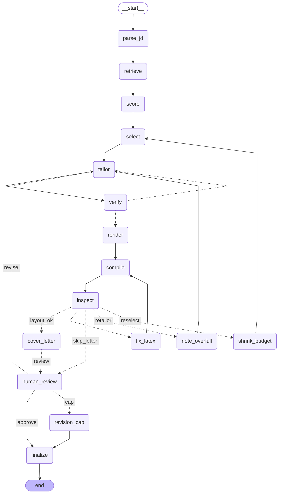

# resume-agent

A LangGraph agent that takes a job description and produces a truthful, one-page,
ATS-clean LaTeX resume and a matching cover letter, grounded entirely in a
structured career knowledge base.

Design: [`RESUME_AGENT_SPEC.md`](RESUME_AGENT_SPEC.md).
Standing rules for contributors (human or otherwise): [`CLAUDE.md`](CLAUDE.md).

**Status: M0-M9 complete — every milestone in the spec.**

* **M0** — the deterministic LaTeX pipeline: `profile.example/` → Pydantic →
  Jinja2 → `.tex` → tectonic → a one-page PDF.
* **M1** — the knowledge base and hybrid retrieval: SQLite + a `sqlite-vec`
  vector index, BM25 and dense retrieval fused with Reciprocal Rank Fusion, and
  query expansion through the `skills.yaml` alias table. No LLM.
* **M2** — job description parsing: a posting becomes a validated `JobSpec` via
  structured output, cached on a hash of the posting, the model and the prompt.
  **This is the first milestone that calls a model.**

* **M3** — scoring, selection and `analyze`: batched relevance scoring in one
  LLM call, a deterministic `FitReport`, and a greedy knapsack that picks what
  fits on one page under every constraint in spec §5.

* **M4** — grounded tailoring and the fabrication gate: bullets are rewritten
  to speak to a posting, then checked against their source by two free
  deterministic layers and one LLM judge. At the retry cap a bullet is
  **dropped**, never shipped unverified.

* **M5** — the graph: everything above wired into a LangGraph `StateGraph`
  with both feedback cycles from spec §2 and their hard caps. A broken
  document is repaired from the compiler's own error message; a two-page
  resume shrinks its line budget and reselects until it fits.

* **M6** — the cover letter, as a LangGraph **subgraph** with its own retry
  cycle: five paragraphs, ≤320 words counted in Python, every figure and
  technology checked against the knowledge base, and a judge that reads the
  résumé's actual bullets to catch a letter that contradicts them.

* **M7** — human-in-the-loop, durable checkpoints and the application
  tracker: `--interactive` pauses at a review gate, the paused run survives
  the process that started it, and every finished run writes a tracker row.

* **M8** — the eval harness: 16 job descriptions, six free deterministic
  checks, a five-dimension LLM judge, and a regression gate that fails a
  build when the mean judge score drops more than 0.3.

* **M9** — a FastAPI app with SSE streaming of node events, and a one-file
  frontend: paste a posting, watch the graph tick past node by node, read
  the fit report and the PDF without leaving the page. **There is no web UI** — that is M9.

---

## The web UI

```bash
uv run resume-agent serve
```

Then open <http://127.0.0.1:8000>. Paste a posting, press **Tailor my resume**
(or `Ctrl`/`Cmd`+`Enter` from the textarea), and watch the graph work.

All sixteen nodes are drawn as a pipeline rail, grouped into the five phases
they belong to — read, write, typeset, letter, close — and each one lights up as
its events arrive over SSE. Model calls are shown too, so a twenty-second
tailoring call doesn't look like a hang. When the run ends the rail says how
many stages actually ran: the repair stages (`fix_latex`, `shrink_budget`,
`note_overfull`) only fire when they are needed, and a tick that never lit is
information, not a gap.

Results lead with what is missing — uncovered must-haves and bullets dropped for
failing grounding — before the bullets that made it, because that is the
actionable half. The tracker appears underneath once you have sent anything.

The page reports missing credentials or a missing LaTeX compiler **before** you
press the button rather than after you've waited, and says how to fix each one.
It binds to localhost by default: the API has no authentication and starting a
run spends money.

The frontend is one file with no build step, no framework and no network: no
CDN, no webfonts, nothing fetched off the machine. Two tests hold that line.

## Setup

Requires **Python 3.12** (managed by `uv`) and a **LaTeX compiler**.

```bash
uv sync
```

The first `search` or `index` run downloads a 67 MB ONNX embedding model
(`BAAI/bge-small-en-v1.5`) once. It is cached per-user, not in a temp
directory, so it survives reboots: `%LOCALAPPDATA%/resume-agent/fastembed` on
Windows, `~/.cache/resume-agent/fastembed` elsewhere. After that everything is
offline -- no API key, no per-query cost. Override the location with the
`RESUME_AGENT_MODEL_CACHE` environment variable.

### Your knowledge base

Everything the agent is allowed to say about you lives in a folder called
**`profile/`** at the root of this repository. It does not exist until you make
it, and it is gitignored — your real career data is never committed.

```bash
cp -r profile.example profile
```

Then edit every file to be about you. `profile.example/` is the public fixture
the tests load; leave it in place.

```
profile/
├── identity.yaml          name, email, phone, location, links
├── education.yaml         institutions, degrees, dates
├── skills.yaml            THE allow-list of technologies
├── certifications.yaml    optional
├── experience/            one YAML file per job
├── projects/              one YAML file per project
└── narratives/            markdown prose, feeds the cover letter
```

Two files do more work than the rest. **`skills.yaml`** is an allow-list: if a
tailored bullet names a technology that is not in it, the grounding gate rejects
the bullet. And each bullet's **`metrics`** dict is the complete set of numbers a
rewrite of that bullet may contain — anything else is a fabrication and the
bullet is dropped, loudly.

The **Guide** tab in the web UI explains every field, and the **Profile** tab
shows exactly what loaded, so you can see whether a bullet you wrote is being
read. A file with a mistake is listed there with its error rather than silently
skipped.

You can also skip the copy above entirely: if no `profile/` exists, the Profile
tab offers a **Create my profile** button that scaffolds one from the example.

### Editing from the browser

The Profile tab has two modes. *Browse* renders what loaded; *Edit files* opens
any file in the profile and saves it back. Three guarantees make that safe to do
to non-regenerable data:

- **Your text is written exactly as typed.** The editor moves file text, never
  parsed objects, so comments, `>-` folded scalars, flow-style lists and key
  order all survive. A YAML round-trip through `safe_dump` would silently delete
  every comment in the file on the first save.
- **The whole profile is validated before anything is written.** Validation is
  cross-file — deleting one alias from `skills.yaml` can invalidate an
  experience file you never opened — so the edit is staged into a copy of the
  directory and loaded there first. A save that would break the profile is
  refused and the file on disk is left byte-identical.
- **Every save keeps a timestamped backup** under `.profile-backups/`. `profile/`
  is gitignored, so this is the only undo that exists.

Structured forms instead of YAML would need a comment-preserving parser
(`ruamel.yaml`); that is a reasonable thing to add later and a separate decision.

Point any command at it with `--profile profile`, or pick it from the dropdown
on the Profile tab, which is remembered between visits.

### Model provider

The project was built and tuned against Claude, and Anthropic is still the
default, but nothing outside `llm.py` knows that. Set one key and the matching
provider is selected automatically:

| Provider | Key variable | Generation | Judge |
|---|---|---|---|
| `anthropic` *(default)* | `ANTHROPIC_API_KEY` | `claude-opus-5` | `claude-sonnet-5` |
| `deepseek` | `DEEPSEEK_API_KEY` | `deepseek-v4-pro` | `deepseek-flash` |
| `openrouter` | `OPENROUTER_API_KEY` | `anthropic/claude-opus-5` | `anthropic/claude-sonnet-5` |
| `custom` | `RESUME_AGENT_API_KEY` | *(you set it)* | *(you set it)* |

```bash
resume-agent check-credentials
```

reports which provider is active, which variable it read, and which two models
it will use. It prints the *name* of the variable, never its value.

To force a provider when several keys are present, or to change a model:

```bash
set RESUME_AGENT_PROVIDER=deepseek
set RESUME_AGENT_GENERATION_MODEL=deepseek-flash
```

`custom` reaches any OpenAI-compatible endpoint — Together, Groq, a local
Ollama — with no code change, given `RESUME_AGENT_BASE_URL`,
`RESUME_AGENT_GENERATION_MODEL` and `RESUME_AGENT_API_KEY`.

Every call returns a Pydantic object, and the schema is sent as a **tool**
(`function_calling`) because that is the one mechanism essentially every
provider implements. `langchain-openai` would otherwise default to
`json_schema`, which is an OpenAI feature rather than an OpenAI-protocol one —
DeepSeek answers `400 This response_format type is unavailable now`. Real OpenAI
supports it and it is stricter there, so:

```bash
set RESUME_AGENT_STRUCTURED_OUTPUT=json_schema
```

**Two things worth knowing before switching.** Every prompt in `prompts/` was
written against Claude, and every call goes through `with_structured_output`, so
a different model will parse and rewrite differently. That is a measurable
question rather than a guess — `make eval` scores a run against the baseline, so
switch and then go and look.

The part that does *not* degrade is the fabrication gate. Numbers must trace to
a `metrics` key and technologies must appear in `skills.yaml`, both checked in
plain Python. A weaker model that overreaches gets more bullets **dropped**,
loudly. The failure mode is a thinner resume, not a dishonest one.

### LaTeX compiler

`resume-agent` looks for one of these, in this order (spec §6.4):

1. **tectonic** — recommended. A single self-contained binary that downloads only
   the packages the document needs.
2. **latexmk** — from a full TeX Live or MiKTeX install.
3. **docker** — runs the `texlive/texlive` image. Correct, but slow.

Windows, no admin required:

```bash
curl.exe -sSL -o tectonic.zip https://github.com/tectonic-typesetting/tectonic/releases/download/tectonic%400.17.0/tectonic-0.17.0-x86_64-pc-windows-msvc.zip
```

Extract `tectonic.exe` into `%LOCALAPPDATA%\Programs\tectonic\` — the compiler
resolver checks there explicitly, so it does not need to be on `PATH`. On macOS,
`brew install tectonic`.

Installed somewhere unusual? Point at it directly:

```bash
set RESUME_AGENT_TECTONIC=C:\path\to\tectonic.exe
```

If nothing is found, `resume-agent` prints install instructions and exits 3 — it
never raises a stack trace at you.

---

## Use

```bash
uv run resume-agent build --profile profile.example --out out/
```

Writes `out/resume.tex`, `out/resume.pdf` and `out/compile.log`, then reports the
compiler used, the page count and any overfull hboxes.

Exit codes: `0` success · `1` compile failed · `2` profile invalid · `3` no compiler.

### Parsing a job description

Needs `ANTHROPIC_API_KEY`; everything else in this project works without one.

```bash
uv run resume-agent parse-jd --jd evals/datasets/jds/mid.txt
```

Prints the requirements sorted by weight, with **inferred priorities shown
separately** — things the posting keeps circling back to without ever listing as
a requirement. Add `--json` for the raw `JobSpec`.

Parses are cached under `.cache/jd/` on `sha256(posting + model + prompt)`, so
re-running while you iterate downstream costs nothing. The prompt hash is in the
key deliberately: editing `prompts/parse_jd.md` invalidates the parses it
produced rather than silently serving stale ones.

Model is `claude-opus-5` (`PARSE_MODEL` in `llm.py`), about $0.05–0.07 per
posting.

### Analysing a posting  ← the one you'll use daily

```bash
uv run resume-agent analyze --jd evals/datasets/jds/mid.txt
```

Answers "should I apply, and what am I missing?". Prints the recommendation
first, then **gaps before coverage** — what you lack is actionable, what you have
is reassurance. Must-have gaps are separated from nice-to-haves, and inferred
requirements are marked so you never think you failed to meet something the
posting never asked for.

It also shows what selection chose for the resume and, for everything it didn't,
the constraint that excluded it — because "why is my best bullet missing?" is
the first question anyone asks of a selector.

`--strict` drops bullets marked `confidence: claim`. `--json` emits the raw
`FitReport`. Needs `ANTHROPIC_API_KEY`; costs roughly $0.20 per new posting and
nothing on a re-run.

### Running the whole agent

```bash
uv run resume-agent run --jd evals/datasets/jds/mid.txt
```

Parse → retrieve → score → select → tailor → verify → render → compile →
inspect → finalize, with both loops live. Writes a run directory containing
`resume.pdf`, `resume.tex`, `compile.log` and `run.json`.

`run.json` is the record spec §5 asks for: the parsed posting, the fit report,
which bullet ids were used, which were **dropped for failing grounding**, the
model ids and prompt hashes that produced it, and the profile's git SHA. It is
what lets you ask, months from now, which bullets appear in applications that
got callbacks.

It also writes `cover_letter.pdf` — five paragraphs, at most 320 words,
checked against the same knowledge base as the résumé and against the
résumé's own bullets. `--no-cover-letter` skips it.

`--no-judge` skips the paid grounding judge while keeping both free
deterministic layers. `--strict` drops `confidence: claim` bullets.

### Reviewing before you send

```bash
uv run resume-agent run --jd job.txt --interactive
```

Stops at a review gate showing the recommendation, the must-have gaps, anything
the verifier dropped, the bullets, and the letter — then **exits**. The paused
run is checkpointed to SQLite, so it is still there tomorrow, or after a reboot:

```bash
uv run resume-agent resume-run --jd job.txt
uv run resume-agent resume-run --jd job.txt --revise "lead with the Kafka work"
```

`--revise` feeds your note back as a critique and re-tailors, up to three rounds.

### The tracker

Every finished run writes a row. The `outcome` column starts empty because it is
the one thing that cannot be computed:

```bash
uv run resume-agent applications
uv run resume-agent applications --set-outcome-for 3 --to callback
uv run resume-agent applications --by-bullet
```

`--by-bullet` answers the question spec §11 poses — *which bullets appear in
applications that got callbacks?* — and it is worth exactly as much as the
outcomes you bother to record.

### Evaluating a change

```bash
make eval                    # the full set: table + results JSON
make eval-free               # deterministic checks only, no judge calls
make eval-worsened           # the deliberately sabotaged tailoring prompt
```

```
jd                            det  rel spec  ats tone filler   mean
-------------------------------------------------------------------
senior_api_platform            ok    5    5    5    4      5   4.80
mid_data_platform              ok    4    5    4    4      4   4.20
junior_frontend                ok    3    3    3    4      4   3.40
senior_ml                      ok    2    2    2    3      3   2.40
-------------------------------------------------------------------
mean                               3.5  3.8  3.5  3.8    4.0   3.70
```

The point is not the table, it's the gate:

```bash
uv run python evals/run_eval.py --check-against evals/baselines/main.json
```

Exits non-zero when the mean judge score drops by more than 0.3, so a prompt
change that makes things worse fails a build instead of being argued about.
`evals/variants/tailor_bullets.worsened.md` is a deliberately bad prompt that
exists to prove the gate fires — a harness that can't detect *that* isn't
measuring anything.

**Cost:** a full run generates 16 resumes, so roughly $10–15 the first time and
near-free afterwards (parses, scores and first-pass rewrites are all cached on
the posting and the prompt hash). `--limit N` and `--no-judge` are there for
when you don't want to pay for the whole set.

### Searching the knowledge base

```bash
uv run resume-agent search "kubernetes" --explain
```

`--explain` shows where each retriever placed a bullet next to the fused score,
and `--mode bm25` / `--mode dense` run one retriever alone. That comparison is
the point: querying `kubernetes` against the example profile, BM25 returns the
single bullet that literally says Kubernetes, while dense returns a full ranking
in which a DuckDB linter scores 0.69. Fusion keeps the exact match on top
without throwing away the semantic recall that finds "reduce cloud spend" →
"Cut monthly AWS spend 38%".

The index lives in `.index/` (gitignored), is keyed on a hash of the profile's
YAML, and rebuilds itself when that changes — `resume-agent index --rebuild`
forces it.

---

## The graph

Both feedback cycles from spec §2, with their caps. This diagram is **generated
from the compiled graph** by `scripts/render_graph.py`, not drawn by hand, so it
cannot quietly stop being true when an edge moves.

<!-- graph:start -->



<!-- graph:end -->

* **Grounding cycle** (`verify` → `tailor`), 2 retries, then the bullet is
  dropped with a loud log. Never ship an unverified claim.
* **Layout cycle** (`inspect` → `fix_latex` / `shrink_budget` / `note_overfull`),
  3 retries, then finalize with the best artifact so far. Never spin.
* **Revision cycle** (`human_review` → `tailor`), 3 rounds, then finalize the
  current draft. Your notes come back as critiques, which is the same shape
  a verifier objection has.
* **Cover letter cycle**, inside the `cover_letter` subgraph and invisible
  here by design: draft → verify → draft, 2 retries, then **no letter**. The
  résumé still ships. A letter is one artifact, so unlike a bullet there is
  nothing to partially drop.

---

## Development

There is a `Makefile`, but `make` is not standard on Windows. The underlying
commands:

| Task | `make` | direct |
|---|---|---|
| Install deps | `make setup` | `uv sync` |
| Run tests | `make test` | `uv run pytest -v` |
| Tests, no compiler needed | `make test-fast` | `uv run pytest -m "not latex"` |
| Lint | `make lint` | `uv run ruff check .` |
| Build the example resume | `make build` | `uv run resume-agent build --profile profile.example --out out/` |
| Build the search index | `make index` | `uv run resume-agent index --profile profile.example` |
| Inspect retrieval | `make search Q="redis"` | `uv run resume-agent search "redis" --explain` |
| Parse a JD | `make parse-jd` | `uv run resume-agent parse-jd --jd evals/datasets/jds/mid.txt` |
| Analyse a JD | `make analyze` | `uv run resume-agent analyze --jd evals/datasets/jds/mid.txt` |
| Run the agent | `make run` | `uv run resume-agent run --jd evals/datasets/jds/mid.txt` |
| Regenerate the graph diagram | `make graph` | `uv run python scripts/render_graph.py` |
| Re-derive the line budget | `make calibrate-budget` | `uv run python scripts/calibrate_line_budget.py` |
| Regenerate JD snapshots | `make snapshots` | `REGEN_SNAPSHOTS=1 uv run pytest tests/test_parse_jd.py -m llm` |
| Re-derive `CHARS_PER_LINE` | `make calibrate` | `uv run python scripts/calibrate_chars_per_line.py` |
| Regenerate the golden `.tex` | `make golden` | `REGEN_GOLDEN=1 uv run pytest tests/test_render_compile.py::test_golden_tex_snapshot` |

---

## What lives where

```
profile.example/          fake profile; what tests load. `profile/` is real data and is gitignored.
src/resume_agent/
  models/profile.py       the evidence-unit schema (spec §3.1, §3.2)
  kb/loader.py            YAML -> Pydantic, with cross-file integrity checks
  kb/tokenize.py          technology-aware tokenizer ("C#" stays "c#")
  kb/embeddings.py        local ONNX embeddings behind LangChain's interface
  kb/index.py             SQLite + sqlite-vec; staleness via a content hash
  kb/retriever.py         query expansion, BM25, dense, RRF (k=60)
  models/job.py           JobSpec (spec §4); source_hash is computed, not generated
  llm.py                  model id, effort, prompt loading + versioning
  jd_cache.py             on-disk parse cache
  prompts/parse_jd.md     the JD-parsing prompt, versioned
  graph/nodes/parse_jd.py parse_job_description()
  graph/nodes/retrieve.py per-requirement retrieval + dedupe (no LLM)
  graph/nodes/score.py    one batched scoring call; FitReport built in Python
  graph/nodes/select.py   the greedy knapsack (no LLM)
  graph/nodes/tailor.py   grounded rewriting + the retry cycle
  graph/nodes/verify.py   the fabrication gate, cheap layers first
  grounding/numbers.py    which numbers a rewrite may contain
  grounding/vocabulary.py which technologies a rewrite may name
  latex/layout.py         line budget, measured by compiling six profile shapes
  analyze.py / report.py  the analyze pipeline and its human-readable output
  graph/state.py          AgentState + RunOptions
  graph/build.py          every node, and EVERY edge (CLAUDE.md rule 6)
  graph/nodes/            one file per node; nodes import nothing from each other
  cache.py                model-output cache for the expensive nodes
  graph/checkpoint.py     SqliteSaver, stable thread ids, type allowlist
  graph/nodes/review.py   the interrupt() gate and the revision cap
  tracker/                the application table; outcomes you fill in by hand
  api/                    FastAPI app, SSE, and a single static page
evals/                    the eval set, its checks, the judge, the gate
  graph/nodes/cover_letter.py  the letter subgraph: draft -> verify -> retry
  models/letter.py        CoverLetter; word_count is computed, not returned
  templates/cover_letter.tex.j2  the letter's own template (spec §5)
profile.example/narratives/  markdown source material for the letter
  latex/escape.py         latex_escape() -- one regex pass, 13 characters
  latex/env.py            the Jinja environment with \VAR{} / \BLOCK{} delimiters
  latex/context.py        Profile -> template dict (dates, ordering, skill grouping)
  latex/compile.py        the tectonic -> latexmk -> docker fallback chain
  latex/inspect.py        page count, overfull hboxes, first LaTeX error
  latex/metrics.py        CHARS_PER_LINE, measured not guessed
  templates/              jake_resume.tex.j2 (Jake's Resume, MIT, adapted)
scripts/                  calibrate_chars_per_line.py
tests/                    escape fixtures, golden .tex, a real compile
```

---

## Three things worth knowing before you edit

**The escaper is enforced, not trusted.** Every value interpolated into the
template is written `\VAR{x | tex}`. `tests/test_env.py` parses the template and
fails if any interpolation is missing the filter — that mechanical check is what
makes the explicit style safe.

**Nothing reaches the page unverified.** Every rewritten bullet is checked
against its source: numbers must trace to that bullet's `metrics` or already
appear in the source sentence, newly-named technologies must exist in
`skills.yaml`, and a judge catches semantic inflation the regexes cannot see
("led a team" from "collaborated with two engineers"). Two retries, then the
bullet is dropped with a loud log — never shipped because the budget ran out.
`tests/test_verifier.py` is the most important file in the repo.

**Retrieval quality is tested without labels.** Most of the retrieval suite
asserts invariants rather than opinions: every bullet must retrieve itself,
`k8s` and `kubernetes` must return identical results, and RRF's arithmetic is
pinned exactly. On top of that sits a small hand-written relevance set in
`tests/fixtures/retrieval_expectations.yaml` — including queries for things the
profile genuinely lacks, which must *not* come back looking answered.

**Both layout constants are measured, not guessed.** `CHARS_PER_LINE = 109`
comes from compiling probe bullets at lengths 60–140 and reading back where
wrapping starts. The one-page line budget comes from compiling six different
profile shapes and solving for each element's cost; the resulting additive model
reproduces all six measurements with zero error, and `test_layout.py` pins that.

**`CHARS_PER_LINE` is measured.** It is 109 for this template, derived by
compiling probe bullets at every length from 60 to 140 and reading back from the
PDF where wrapping starts. The spec's ballpark was ~95. Re-run `make calibrate`
after any change to the template's geometry, font or list nesting.

---

## Licence note

`src/resume_agent/templates/jake_resume.tex.j2` is adapted from
[jakegut/resume](https://github.com/jakegut/resume), MIT licensed,
© 2020 Jake Gutierrez. The licence text is reproduced in the template header.
